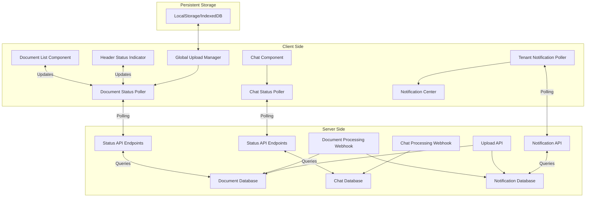

# Real-Time Features Implementation Plan

## Overview

This plan outlines how to implement real-time features for the Brandt chatbot application, focusing on:

1. Real-time AI chat response updates
2. Document processing status tracking that persists across page navigation
3. Tenant-wide notifications for document uploads and processing
4. Multi-tenant isolation
5. Compatibility with serverless deployment (e.g., Vercel)

## Architecture Diagram



## Implementation Steps

### 1. Create a Global Upload Manager Context

First, create a context provider to manage uploads globally across the application:

```typescript
// providers/upload-provider.tsx
'use client';

import React, { createContext, useContext, useState, useEffect } from 'react';
import { useLocalStorage } from '@/hooks/use-local-storage';

export interface UploadItem {
  id: string;
  fileName: string;
  status: 'uploading' | 'processing' | 'complete' | 'failed';
  progress: number;
  tenantId: string;
  documentId?: string;
  error?: string;
  startTime: number;
  lastUpdated: number;
}

interface UploadContextType {
  uploads: UploadItem[];
  addUpload: (upload: Omit<UploadItem, 'id' | 'startTime' | 'lastUpdated'>) => string;
  updateUpload: (id: string, updates: Partial<UploadItem>) => void;
  removeUpload: (id: string) => void;
  clearCompleted: () => void;
}

const UploadContext = createContext<UploadContextType | null>(null);

export function UploadProvider({ children }: { children: React.ReactNode }) {
  // Use localStorage to persist uploads across page navigation
  const [uploads, setUploads] = useLocalStorage<UploadItem[]>('document-uploads', []);
  
  // Clean up stale uploads on mount (older than 24 hours)
  useEffect(() => {
    const now = Date.now();
    const DAY_IN_MS = 24 * 60 * 60 * 1000;
    
    setUploads(prev => 
      prev.filter(upload => now - upload.lastUpdated < DAY_IN_MS)
    );
  }, []);
  
  // Add a new upload
  const addUpload = (upload: Omit<UploadItem, 'id' | 'startTime' | 'lastUpdated'>) => {
    const id = `upload_${Date.now()}_${Math.random().toString(36).substring(2, 9)}`;
    const now = Date.now();
    
    const newUpload: UploadItem = {
      ...upload,
      id,
      startTime: now,
      lastUpdated: now,
    };
    
    setUploads(prev => [...prev, newUpload]);
    return id;
  };
  
  // Update an existing upload
  const updateUpload = (id: string, updates: Partial<UploadItem>) => {
    setUploads(prev => 
      prev.map(upload => 
        upload.id === id 
          ? { ...upload, ...updates, lastUpdated: Date.now() } 
          : upload
      )
    );
  };
  
  // Remove an upload
  const removeUpload = (id: string) => {
    setUploads(prev => prev.filter(upload => upload.id !== id));
  };
  
  // Clear completed uploads
  const clearCompleted = () => {
    setUploads(prev => 
      prev.filter(upload => 
        upload.status !== 'complete' && upload.status !== 'failed'
      )
    );
  };
  
  return (
    <UploadContext.Provider value={{ 
      uploads, 
      addUpload, 
      updateUpload, 
      removeUpload,
      clearCompleted
    }}>
      {children}
    </UploadContext.Provider>
  );
}

export function useUploads() {
  const context = useContext(UploadContext);
  if (!context) {
    throw new Error('useUploads must be used within an UploadProvider');
  }
  return context;
}
```

### 2. Create a Local Storage Hook

Create a hook to handle localStorage with proper serialization:

```typescript
// hooks/use-local-storage.ts
'use client';

import { useState, useEffect } from 'react';

export function useLocalStorage<T>(key: string, initialValue: T) {
  // State to store our value
  const [storedValue, setStoredValue] = useState<T>(initialValue);

  // Initialize on first render only
  useEffect(() => {
    try {
      if (typeof window === 'undefined') {
        return;
      }
      
      // Get from local storage by key
      const item = window.localStorage.getItem(key);
      
      // Parse stored json or if none return initialValue
      setStoredValue(item ? JSON.parse(item) : initialValue);
    } catch (error) {
      console.error(`Error reading localStorage key "${key}":`, error);
      setStoredValue(initialValue);
    }
  }, [key, initialValue]);

  // Return a wrapped version of useState's setter function that
  // persists the new value to localStorage
  const setValue = (value: T | ((val: T) => T)) => {
    try {
      if (typeof window === 'undefined') {
        console.warn(`Tried to set localStorage key "${key}" but window is undefined`);
        return;
      }
      
      // Allow value to be a function so we have same API as useState
      const valueToStore =
        value instanceof Function ? value(storedValue) : value;
      
      // Save state
      setStoredValue(valueToStore);
      
      // Save to local storage
      window.localStorage.setItem(key, JSON.stringify(valueToStore));
    } catch (error) {
      console.error(`Error setting localStorage key "${key}":`, error);
    }
  };

  return [storedValue, setValue] as const;
}
```

### 3. Create a Document Status Polling Hook

Create a hook to poll for document status updates:

```typescript
// hooks/use-document-status.ts
'use client';

import { useState, useEffect, useRef } from 'react';
import { useSession } from 'next-auth/react';
import { useTenant } from '@/providers/tenant-provider';
import { useUploads } from '@/providers/upload-provider';

export function useDocumentStatus() {
  const { data: session } = useSession();
  const { tenantId } = useTenant();
  const { uploads, updateUpload } = useUploads();
  const [isPolling, setIsPolling] = useState(false);
  const pollingIntervalRef = useRef<NodeJS.Timeout | null>(null);
  
  // Find documents that need status updates
  const getDocumentsToCheck = () => {
    return uploads.filter(upload => 
      upload.status === 'processing' && 
      upload.documentId && 
      upload.tenantId === tenantId
    );
  };
  
  // Poll for document status updates
  const pollDocumentStatus = async () => {
    if (!session || !tenantId) return;
    
    const documentsToCheck = getDocumentsToCheck();
    if (documentsToCheck.length === 0) {
      setIsPolling(false);
      return;
    }
    
    setIsPolling(true);
    
    try {
      // Get document IDs to check
      const documentIds = documentsToCheck.map(doc => doc.documentId).filter(Boolean);
      
      // Fetch status updates for these documents
      const response = await fetch(`/api/tenants/${tenantId}/documents/status`, {
        method: 'POST',
        headers: {
          'Content-Type': 'application/json',
        },
        body: JSON.stringify({ documentIds }),
      });
      
      if (!response.ok) {
        throw new Error('Failed to fetch document status updates');
      }
      
      const statusUpdates = await response.json();
      
      // Update document statuses
      for (const update of statusUpdates) {
        const upload = documentsToCheck.find(doc => doc.documentId === update.id);
        if (upload) {
          updateUpload(upload.id, {
            status: update.status === 'PROCESSED' 
              ? 'complete' 
              : update.status === 'FAILED' 
                ? 'failed' 
                : 'processing',
            error: update.error,
          });
        }
      }
    } catch (error) {
      console.error('Error polling for document status:', error);
    }
  };
  
  // Start polling when there are documents to check
  useEffect(() => {
    if (!session || !tenantId) return;
    
    const documentsToCheck = getDocumentsToCheck();
    
    if (documentsToCheck.length > 0 && !isPolling) {
      // Start polling
      pollingIntervalRef.current = setInterval(pollDocumentStatus, 5000);
      setIsPolling(true);
    } else if (documentsToCheck.length === 0 && isPolling) {
      // Stop polling
      if (pollingIntervalRef.current) {
        clearInterval(pollingIntervalRef.current);
        pollingIntervalRef.current = null;
      }
      setIsPolling(false);
    }
    
    // Initial poll
    if (documentsToCheck.length > 0) {
      pollDocumentStatus();
    }
    
    // Cleanup
    return () => {
      if (pollingIntervalRef.current) {
        clearInterval(pollingIntervalRef.current);
      }
    };
  }, [session, tenantId, uploads]);
  
  return { isPolling };
}
```

### 4. Create a Document Status API Endpoint

Create an API endpoint to check document status:

```typescript
// app/api/tenants/[tenantId]/documents/status/route.ts
import { NextRequest, NextResponse } from "next/server";
import { getServerSession } from "next-auth";
import { authOptions } from "@/app/api/auth/[...nextauth]/route";
import { prisma } from "@/lib/prisma";

export async function POST(
  request: NextRequest,
  context: { params: { tenantId: string } }
) {
  try {
    // Get the session to verify authentication
    const session = await getServerSession(authOptions);

    if (!session) {
      return NextResponse.json({ error: "Unauthorized" }, { status: 401 });
    }

    // Get tenant ID from params
    const { tenantId } = context.params;

    // Check if user has access to this tenant
    if (session.user.role !== "ADMIN" && session.user.tenantId !== tenantId) {
      return NextResponse.json({ error: "Forbidden" }, { status: 403 });
    }

    // Parse request body
    const body = await request.json();
    const { documentIds } = body;

    if (!Array.isArray(documentIds) || documentIds.length === 0) {
      return NextResponse.json(
        { error: "Invalid document IDs" },
        { status: 400 }
      );
    }

    // Get status for the requested documents
    const documents = await prisma.document.findMany({
      where: {
        id: { in: documentIds },
        tenantId: tenantId,
      },
      select: {
        id: true,
        status: true,
        metadata: true,
      },
    });

    // Format the response
    const statusUpdates = documents.map((doc) => {
      const metadata = doc.metadata as any || {};
      return {
        id: doc.id,
        status: doc.status,
        error: metadata.error || null,
      };
    });

    return NextResponse.json(statusUpdates);
  } catch (error: any) {
    console.error("Error fetching document status:", error);
    return NextResponse.json(
      { error: `Error fetching document status: ${error.message}` },
      { status: 500 }
    );
  }
}
```

### 5. Create a Header Status Indicator Component

Create a component to show document processing status in the header:

```typescript
// components/document/processing-status-indicator.tsx
'use client';

import { useState } from 'react';
import { useUploads } from '@/providers/upload-provider';
import { useDocumentStatus } from '@/hooks/use-document-status';
import { FileText, X, CheckCircle, AlertCircle, Loader2 } from 'lucide-react';
import { formatDistanceToNow } from 'date-fns';

export function ProcessingStatusIndicator() {
  const { uploads, clearCompleted } = useUploads();
  const { isPolling } = useDocumentStatus(); // This will poll for status updates
  const [isOpen, setIsOpen] = useState(false);
  
  // Count uploads by status
  const uploading = uploads.filter(u => u.status === 'uploading').length;
  const processing = uploads.filter(u => u.status === 'processing').length;
  const completed = uploads.filter(u => u.status === 'complete').length;
  const failed = uploads.filter(u => u.status === 'failed').length;
  
  // Total active uploads (uploading or processing)
  const activeCount = uploading + processing;
  
  // Don't render anything if no uploads
  if (uploads.length === 0) {
    return null;
  }
  
  return (
    <div className="relative">
      {/* Status Indicator Button */}
      <button
        className="relative p-2 rounded-full hover:bg-gray-100 flex items-center"
        onClick={() => setIsOpen(!isOpen)}
      >
        <FileText className="h-5 w-5 text-gray-600" />
        {activeCount > 0 && (
          <span className="absolute top-0 right-0 inline-flex items-center justify-center px-2 py-1 text-xs font-bold leading-none text-white transform translate-x-1/2 -translate-y-1/2 bg-blue-500 rounded-full">
            {activeCount}
          </span>
        )}
        <span className="ml-2 text-sm font-medium text-gray-700">Documents</span>
      </button>
      
      {/* Status Dropdown */}
      {isOpen && (
        <div className="absolute right-0 mt-2 w-80 bg-white rounded-md shadow-lg overflow-hidden z-50">
          <div className="p-3 border-b border-gray-200">
            <div className="flex items-center justify-between">
              <h3 className="text-sm font-medium">Document Processing</h3>
              <button
                className="text-gray-400 hover:text-gray-500"
                onClick={() => setIsOpen(false)}
              >
                <X className="h-4 w-4" />
              </button>
            </div>
          </div>
          
          <div className="max-h-96 overflow-y-auto">
            {uploads.length === 0 ? (
              <div className="p-4 text-center text-sm text-gray-500">
                No documents being processed
              </div>
            ) : (
              <div>
                {/* Status Summary */}
                <div className="p-3 bg-gray-50 border-b border-gray-200">
                  <div className="grid grid-cols-4 gap-2 text-center text-xs">
                    {uploading > 0 && (
                      <div className="bg-blue-100 p-2 rounded">
                        <span className="font-medium">{uploading}</span>
                        <span className="block">Uploading</span>
                      </div>
                    )}
                    {processing > 0 && (
                      <div className="bg-amber-100 p-2 rounded">
                        <span className="font-medium">{processing}</span>
                        <span className="block">Processing</span>
                      </div>
                    )}
                    {completed > 0 && (
                      <div className="bg-green-100 p-2 rounded">
                        <span className="font-medium">{completed}</span>
                        <span className="block">Completed</span>
                      </div>
                    )}
                    {failed > 0 && (
                      <div className="bg-red-100 p-2 rounded">
                        <span className="font-medium">{failed}</span>
                        <span className="block">Failed</span>
                      </div>
                    )}
                  </div>
                  
                  {(completed > 0 || failed > 0) && (
                    <button
                      className="mt-2 text-xs text-blue-600 hover:text-blue-800 w-full text-center"
                      onClick={() => clearCompleted()}
                    >
                      Clear completed/failed
                    </button>
                  )}
                </div>
                
                {/* Document List */}
                <ul className="divide-y divide-gray-200">
                  {uploads.map((upload) => (
                    <li key={upload.id} className="p-3 hover:bg-gray-50">
                      <div className="flex items-start space-x-3">
                        <div className="flex-shrink-0">
                          {upload.status === 'uploading' && (
                            <Loader2 className="h-5 w-5 text-blue-500 animate-spin" />
                          )}
                          {upload.status === 'processing' && (
                            <Loader2 className="h-5 w-5 text-amber-500 animate-spin" />
                          )}
                          {upload.status === 'complete' && (
                            <CheckCircle className="h-5 w-5 text-green-500" />
                          )}
                          {upload.status === 'failed' && (
                            <AlertCircle className="h-5 w-5 text-red-500" />
                          )}
                        </div>
                        <div className="flex-1 min-w-0">
                          <p className="text-sm font-medium text-gray-900 truncate">
                            {upload.fileName}
                          </p>
                          <p className="text-xs text-gray-500">
                            {upload.status === 'uploading' && `Uploading (${upload.progress}%)`}
                            {upload.status === 'processing' && 'Processing...'}
                            {upload.status === 'complete' && 'Processing complete'}
                            {upload.status === 'failed' && (upload.error || 'Processing failed')}
                          </p>
                          <p className="text-xs text-gray-400 mt-1">
                            {formatDistanceToNow(new Date(upload.startTime), { addSuffix: true })}
                          </p>
                        </div>
                      </div>
                    </li>
                  ))}
                </ul>
              </div>
            )}
          </div>
        </div>
      )}
    </div>
  );
}
```

### 6. Update the File Uploader Component

Modify the file uploader to use the global upload manager:

```typescript
// components/document/file-uploader.tsx (modified)
// Add these imports
import { useUploads } from '@/providers/upload-provider';

// Inside the FileUploader component
const { addUpload, updateUpload } = useUploads();

// Modify the uploadFile function
const uploadFile = async (file: File): Promise<string | null> => {
  try {
    // Create an upload entry in the global manager
    const uploadId = addUpload({
      fileName: file.name,
      status: 'uploading',
      progress: 0,
      tenantId: tenantId!,
    });
    
    // Update progress for this file
    setUploadProgress(prev => ({
      ...prev,
      [file.name]: 0
    }));
    
    // Simulate progress updates for this file
    const progressInterval = setInterval(() => {
      const newProgress = Math.min((uploadProgress[file.name] || 0) + 5, 95);
      
      setUploadProgress(prev => ({
        ...prev,
        [file.name]: newProgress
      }));
      
      // Update global upload progress
      updateUpload(uploadId, { progress: newProgress });
    }, 200);

    // Upload file to S3
    const { key, url } = await uploadFileToS3(file);
    
    clearInterval(progressInterval);
    setUploadProgress(prev => ({
      ...prev,
      [file.name]: 100
    }));
    
    // Update global upload progress to 100%
    updateUpload(uploadId, { progress: 100 });

    // Notify the server about the uploaded document
    const documentResponse = await fetch('/api/s3/document-created', {
      method: 'POST',
      headers: {
        'Content-Type': 'application/json',
      },
      body: JSON.stringify({
        key,
        url,
        name: file.name,
        size: file.size,
        type: file.type,
        // Pass the override tenant ID for admins
        overrideTenantId: isAdmin ? tenantId : undefined,
      }),
    });

    if (!documentResponse.ok) {
      throw new Error(`Failed to create document record for ${file.name}`);
    }

    const document = await documentResponse.json();
    
    // Update global upload status to processing
    updateUpload(uploadId, { 
      status: 'processing',
      documentId: document.documentId
    });
    
    // Return the document ID
    return document.documentId || null;
  } catch (error: any) {
    console.error(`Error uploading ${file.name}:`, error);
    
    // Update progress to show error
    setUploadProgress(prev => ({
      ...prev,
      [file.name]: -1 // Use -1 to indicate error
    }));
    
    // Update global upload status to failed
    updateUpload(uploadId, { 
      status: 'failed',
      error: error.message
    });
    
    // Show error toast
    toast.error(
      <div className="flex flex-col gap-1">
        <p className="font-medium">Error uploading {file.name}</p>
        <p className="text-sm">{error.message}</p>
      </div>,
      {
        duration: 5000,
      }
    );
    
    return null;
  }
};

// Remove the window.location.reload() call from handleUpload
// since we'll be using the global status indicator instead
```

### 7. Create a Notification Database Model

Add a notification model to your Prisma schema:

```prisma
// prisma/schema.prisma (add this model)
model Notification {
  id        String   @id @default(cuid())
  type      String   // e.g., "document_uploaded", "document_processed"
  title     String
  message   String
  metadata  Json?
  read      Boolean  @default(false)
  createdAt DateTime @default(now())
  
  // Multi-tenant relation
  tenantId  String
  tenant    Tenant   @relation(fields: [tenantId], references: [id], onDelete: Cascade)
  
  // User relation (who created the notification)
  userId    String
  user      User     @relation(fields: [userId], references: [id], onDelete: Cascade)
  
  @@index([tenantId])
  @@index([userId])
  @@map("notifications")
}
```

Run a migration to add this table:

```bash
npx prisma migrate dev --name add_notifications
```

### 8. Create Notification API Endpoints

Create API endpoints to manage notifications:

```typescript
// app/api/tenants/[tenantId]/notifications/route.ts
import { NextRequest, NextResponse } from "next/server";
import { getServerSession } from "next-auth";
import { authOptions } from "@/app/api/auth/[...nextauth]/route";
import { prisma } from "@/lib/prisma";

// GET /api/tenants/[tenantId]/notifications
export async function GET(
  request: NextRequest,
  context: { params: { tenantId: string } }
) {
  try {
    // Get the session to verify authentication
    const session = await getServerSession(authOptions);

    if (!session) {
      return NextResponse.json({ error: "Unauthorized" }, { status: 401 });
    }

    // Get tenant ID from params
    const { tenantId } = context.params;

    // Check if user has access to this tenant
    if (session.user.role !== "ADMIN" && session.user.tenantId !== tenantId) {
      return NextResponse.json({ error: "Forbidden" }, { status: 403 });
    }

    // Parse query parameters
    const url = new URL(request.url);
    const since = url.searchParams.get("since");
    const limit = parseInt(url.searchParams.get("limit") || "10", 10);
    
    // Build query
    const query: any = {
      where: {
        tenantId: tenantId,
      },
      orderBy: {
        createdAt: "desc",
      },
      take: limit,
      include: {
        user: {
          select: {
            name: true,
            email: true,
          },
        },
      },
    };
    
    // Add since filter if provided
    if (since) {
      query.where.createdAt = {
        gt: new Date(since),
      };
    }

    // Get notifications
    const notifications = await prisma.notification.findMany(query);

    return NextResponse.json({ notifications });
  } catch (error: any) {
    console.error("Error fetching notifications:", error);
    return NextResponse.json(
      { error: `Error fetching notifications: ${error.message}` },
      { status: 500 }
    );
  }
}

// POST /api/tenants/[tenantId]/notifications
export async function POST(
  request: NextRequest,
  context: { params: { tenantId: string } }
) {
  try {
    // Get the session to verify authentication
    const session = await getServerSession(authOptions);

    if (!session) {
      return NextResponse.json({ error: "Unauthorized" }, { status: 401 });
    }

    // Get tenant ID from params
    const { tenantId } = context.params;

    // Check if user has access to this tenant
    if (session.user.role !== "ADMIN" && session.user.tenantId !== tenantId) {
      return NextResponse.json({ error: "Forbidden" }, { status: 403 });
    }

    // Parse request body
    const body = await request.json();
    const { type, title, message, metadata } = body;

    if (!type || !title || !message) {
      return NextResponse.json(
        { error: "Missing required fields" },
        { status: 400 }
      );
    }

    // Create notification
    const notification = await prisma.notification.create({
      data: {
        type,
        title,
        message,
        metadata: metadata || {},
        tenantId,
        userId: session.user.id,
      },
    });

    return NextResponse.json(notification, { status: 201 });
  } catch (error: any) {
    console.error("Error creating notification:", error);
    return NextResponse.json(
      { error: `Error creating notification: ${error.message}` },
      { status: 500 }
    );
  }
}
```

### 9. Create a Notification Service

Create a service to handle notifications:

```typescript
// services/notification-service.ts
import { prisma } from "@/lib/prisma";

export interface NotificationData {
  type: string;
  title: string;
  message: string;
  metadata?: Record<string, any>;
  tenantId: string;
  userId: string;
}

export async function createNotification(data: NotificationData) {
  try {
    const notification = await prisma.notification.create({
      data: {
        type: data.type,
        title: data.title,
        message: data.message,
        metadata: data.metadata || {},
        tenantId: data.tenantId,
        userId: data.userId,
      },
    });
    
    return notification;
  } catch (error) {
    console.error("Error creating notification:", error);
    throw error;
  }
}

export async function getRecentNotifications(tenantId: string, limit = 10, since?: Date) {
  try {
    const query: any = {
      where: {
        tenantId,
      },
      orderBy: {
        createdAt: "desc",
      },
      take: limit,
      include: {
        user: {
          select: {
            name: true,
            email: true,
          },
        },
      },
    };
    
    if (since) {
      query.where.createdAt = {
        gt: since,
      };
    }
    
    const notifications = await prisma.notification.findMany(query);
    
    return notifications;
  } catch (error) {
    console.error("Error fetching notifications:", error);
    throw error;
  }
}

export async function markNotificationAsRead(id: string) {
  try {
    const notification = await prisma.notification.update({
      where: { id },
      data: { read: true },
    });
    
    return notification;
  } catch (error) {
    console.error("Error marking notification as read:", error);
    throw error;
  }
}
```

### 10. Update Document Created API to Create Notifications

Modify the document created API to create notifications:

```typescript
// app/api/s3/document-created/route.ts (modified)
import { createNotification } from "@/services/notification-service";

// Inside the POST handler, after creating the document:
// ...existing code...

// Create document in database
const document = await prisma.document.create({
  data: {
    name,
    type: name.split(".").pop() || "unknown",
    url,
    status: "PROCESSING",
    userId,
    tenantId,
    metadata: {
      size,
      uploadedAt: new Date().toISOString(),
      mimeType: type,
      s3Key: key
    },
  },
  select: {
    id: true
  }
});

// Create notification for the tenant
await createNotification({
  type: "document_uploaded",
  title: "New Document Uploaded",
  message: `${name} has been uploaded and is being processed.`,
  metadata: {
    documentId: document.id,
    documentName: name,
    documentType: type,
    uploadedBy: userId,
  },
  tenantId,