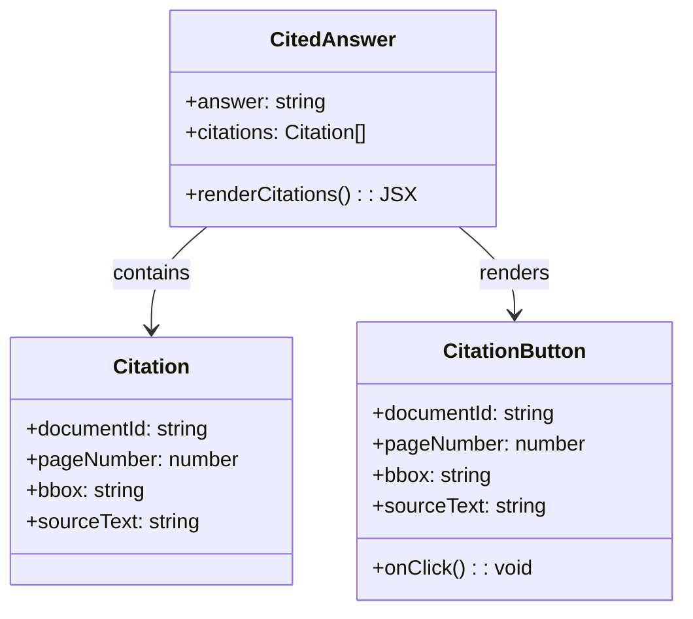
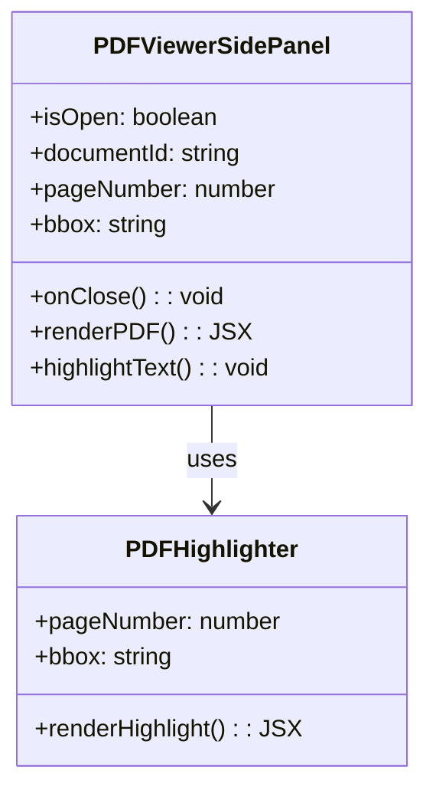
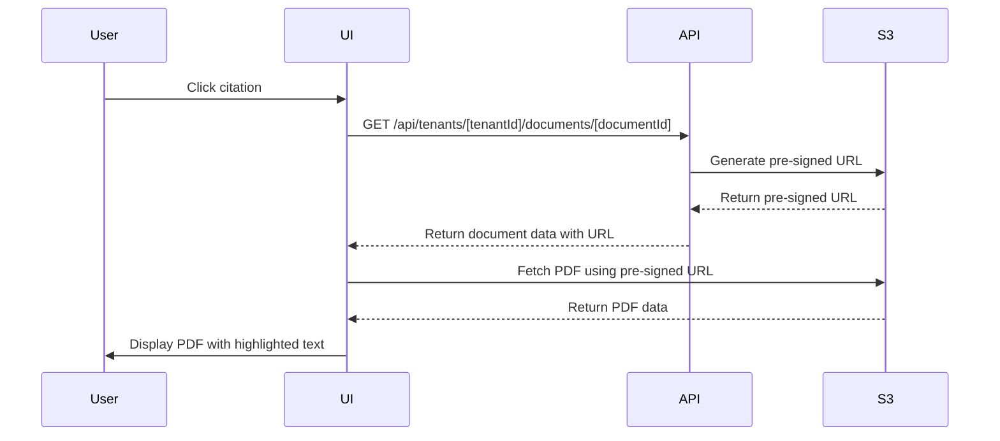
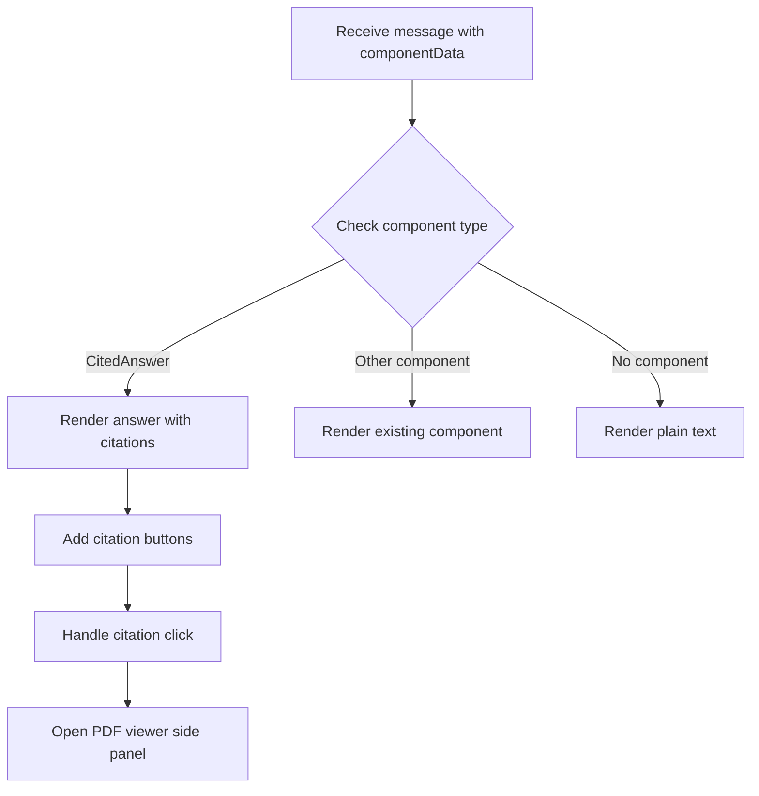
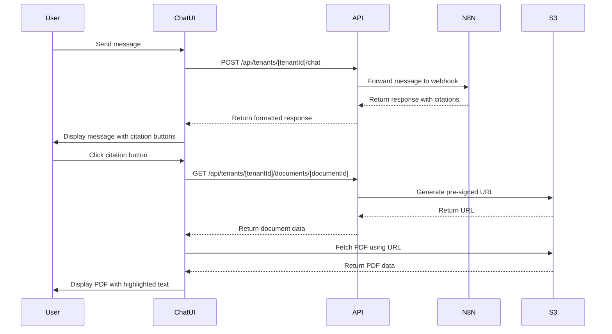

# Citation Feature Implementation Plan

## Overview

The citation feature will allow users to view the source documents referenced by the chatbot in its responses. When the chatbot provides information from a document, it will include citation metadata. Users will be able to click on a citation button/link to open a side panel that displays the PDF document with the relevant text highlighted.

## Requirements

1. Maintain the current response display format
2. Add a button or UI element to trigger the citation flow
3. Implement a side panel PDF viewer using react-pdf
4. Display highlighted text in the PDF based on bbox coordinates
5. Support the citation data format from n8n responses

## Implementation Steps

### 1. Add Citation Component

Create a new component to display citations in chat messages:



### 2. Create PDF Viewer Side Panel

Implement a side panel component that will display the PDF document with highlighted text:



### 3. Add Document Fetching API

Create or modify API endpoints to fetch document data for the PDF viewer:



### 4. Update Chat Message Component

Modify the existing chat message component to handle the new citation format:



## Detailed Technical Implementation

### 1. Install Required Dependencies

```bash
npm install react-pdf @react-pdf/renderer pdfjs-dist
```

### 2. Create Citation Components

1. Create a new component for displaying citations in chat messages
2. Create a PDF viewer side panel component using react-pdf
3. Implement text highlighting based on bbox coordinates

### 3. Update Chat Message Component

Modify the existing chat message component to handle the new citation format and render citation buttons/links.

### 4. Add Document Fetching Logic

Create or update API endpoints to fetch document data and generate pre-signed URLs for accessing PDFs.

### 5. Implement State Management

Add state management for tracking the currently selected citation and controlling the PDF viewer side panel.

## File Changes

1. **New Files:**
   - `components/chat/citation-button.tsx` - Button component for citations
   - `components/document/pdf-viewer-side-panel.tsx` - Side panel for PDF viewing
   - `components/document/pdf-highlighter.tsx` - Component for highlighting text in PDFs
   - `hooks/use-pdf-viewer.ts` - Custom hook for PDF viewer state management

2. **Modified Files:**
   - `components/chat/chat-message.tsx` - Update to handle citation format
   - `components/chat/chat-container.tsx` - Add PDF viewer side panel
   - `utils/chat-processing.ts` - Update to handle citation data
   - `app/api/tenants/[tenantId]/chat/route.ts` - Ensure citation data is preserved

## UI/UX Design

### Citation Button/Link
- Small, unobtrusive button or link directly on the AI response chat bubble
- Positioned near the cited text within the chat bubble
- Visual indicator (e.g., quote icon) to show it's a citation
- Hover state to indicate it's clickable

#### Visual Mockup

Here's a visual mockup of how the citation button will appear on the chat bubble:

```
┌─────────────────────────────────────────────────────────────────┐
│                                                                 │
│  ┌─────────────────────────────────────────────────────────┐    │
│  │                                                         │    │
│  │  Based on my search results, I've found information     │    │
│  │  about the steering filter for the RT8 machine in       │    │
│  │  the John Deere documentation.                          │    │
│  │                                                         │    │
│  │  For the 8RT Series Track Tractors (including models    │    │
│  │  8320RT, 8345RT, and 8370RT), the steering filter       │    │
│  │  part number is RE577250. According to the maintenance  │    │
│  │  schedule, this filter should be replaced after every   │    │
│  │  1500 hours of operation. [📄]                          │    │
│  │                                                         │    │
│  │                                                         │    │
│  └─────────────────────────────────────────────────────────┘    │
│                                                                 │
└─────────────────────────────────────────────────────────────────┘
```

In this mockup:
- The citation button is represented by the [📄] icon at the end of the cited text
- When the user hovers over this icon, it will change appearance (e.g., highlight or change color)
- Clicking the icon will open the PDF viewer side panel with the highlighted text

Alternative designs could include:
1. Superscript numbers like academic citations [¹]
2. Quote icon ["]
3. Info icon [ℹ]
4. Underlined text with the icon at the end

The final design will be consistent with the application's existing UI design language.

### PDF Viewer Side Panel
- Slides in from the right side of the screen
- Close button in the top corner
- PDF document displayed with highlighted text
- Navigation controls for multi-page documents
- Automatic scrolling to the highlighted text

## Data Flow



## Testing Strategy

1. **Unit Tests:**
   - Test citation button component
   - Test PDF viewer component
   - Test highlighting logic

2. **Integration Tests:**
   - Test chat flow with citation responses
   - Test document fetching and display

3. **Manual Testing:**
   - Verify citation buttons appear correctly
   - Verify PDF viewer opens and displays correctly
   - Verify text highlighting works with different bbox values
   - Test with various document sizes and types

## Fallback Handling

1. **Document Not Found:**
   - Display error message in side panel
   - Provide option to retry or close

2. **PDF Loading Failure:**
   - Show loading spinner during fetch
   - Display error message if loading fails
   - Provide retry option

3. **Invalid bbox Coordinates:**
   - Fallback to displaying the entire page
   - Log error for debugging

## Implementation Timeline

1. **Phase 1: Core Components (2-3 days)**
   - Create citation button component
   - Create PDF viewer side panel
   - Implement basic PDF loading

2. **Phase 2: Integration (2-3 days)**
   - Integrate with chat message component
   - Connect to document API
   - Implement state management

3. **Phase 3: Text Highlighting (1-2 days)**
   - Implement bbox-based text highlighting
   - Test with various document formats

4. **Phase 4: Testing & Refinement (1-2 days)**
   - Test all components and flows
   - Fix bugs and edge cases
   - Optimize performance

## Example Response Format

```json
{
  "component": "CitedAnswer",
  "props": {
    "answer": "For the 8RT Series Track Tractors (including models 8320RT, 8345RT, and 8370RT), the steering filter part number is RE577250. According to the maintenance schedule, this filter should be replaced after every 1500 hours of operation.",
    "citations": [
      {
        "documentId": "cmcc401sy000dd8kcugb9qufb",
        "pageNumber": 1,
        "bbox": "107.39669799804688,-2.9035072326660156,689.21533203125,38.168479919433594",
        "sourceText": "REPLACEMENT PARTS GUIDE 8RT Final Tier 4 (FT4) Series Track Tractors [PHONE_REDACTED]00) – 8320RT, 8345RT, 8370RT FILTER OVERVIEW WITH SERVICE INTERVALS RX535027 ENGINE ENGINE CAB Jan 2024. Release Date. FUEL TANK VENT FILTER H216169 Replace after every 1500 hours. OIL FILTER RE509672 - Filter Element Initial oil and filter change at 100 hours and then after every 500 hours or annually, whichever comes first.The extended 500 hour interval is only allowed if using Plus-50™ II oil with a John Deere filter and diesel fuel with sulfur content less than 15mg/kg (15ppm).If all conditions are not met, change oil and filter at 250 hours of operation. FRESH AIR FILTER RE284091 RE333567 (CARBON) Replace after every 1000 hours or annually, whichever occurs first. (Interval may vary according to operating conditions.) CLICK PART NUMBER TO BUY 5 5 6 PRIMARY AIR FILTER RE587793 (TSN [PHONE_REDACTED]38); (FILTER HOUSING RE325735) RE587791 (TSN 915239-); FILTER HOUSING RE580335) Replace after every 1000 hours, annually, or as indicated, whichever occurs first.(Interval may vary according to operating conditions.) SECONDARY AIR FILTER RE587794 (TSN [PHONE_REDACTED]38); (FILTER HOUSING RE325735) RE587792 (TSN 915239-);FILTER HOUSING RE580335) Replace after every 1000 hours, annually, or as indicated, whichever occurs first. (Interval may vary according to operating conditions.) 1 RECIRCULATION AIR FILTER RE291412 RE333569 (CARBON) Replace after every 1000 hours or annually, whichever occurs first.(Interval may vary acording to operating conditions.) SCV OIL FILTER RE269061 Replace after every 1500 hours. OIL FILTER RE210857 Replace after every 1500 hours. PRIMARY FUEL FILTER – RE539465 SECONDARY FUEL FILTER – DZ112918 FUEL FILTER KIT – RE525523 (T2, T3 Engine, 10 Micron and 2 Micron) (Includes Both Primary And Final Fuel Filters) Replace after every 500 hours. Always replace both filters at same time. STEERING FILTER RE577250 Replace after every 1500 hours. HYDRAULIC / TRANSMISSION"
      }
    ]
  }
}
```

## Text Highlighting Implementation Details

The text highlighting feature is a critical part of the citation functionality. Here's a detailed explanation of how it will work:

### Understanding bbox Coordinates

The `bbox` (bounding box) coordinates provided in the citation data represent the position of text on a PDF page. These coordinates typically follow the format:

```
"bbox": "x1,y1,x2,y2"
```

Where:
- `x1,y1`: The coordinates of the top-left corner of the bounding box
- `x2,y2`: The coordinates of the bottom-right corner of the bounding box

These coordinates are in the PDF coordinate system, where (0,0) is typically at the bottom-left corner of the page, and units are in points (1/72 of an inch).

### Implementing Highlighting with react-pdf

1. **PDF Rendering with react-pdf**:
   - We'll use the `Document` and `Page` components from react-pdf to render the PDF
   - The `onRenderSuccess` callback will be used to access the rendered page dimensions

2. **Coordinate Transformation**:
   - PDF coordinates need to be transformed to match the rendered view's coordinate system
   - This involves scaling the coordinates based on the zoom level and potentially inverting the y-axis

3. **Highlight Overlay**:
   - We'll create a transparent overlay positioned absolutely over the PDF page
   - The highlight will be a semi-transparent colored rectangle positioned using the transformed bbox coordinates

### Example Implementation

```tsx
import { Document, Page } from 'react-pdf';
import { useState } from 'react';

interface HighlightProps {
  bbox: string;
  pageNumber: number;
  scale: number;
}

const PDFHighlighter: React.FC<HighlightProps> = ({ bbox, pageNumber, scale }) => {
  const [pageDimensions, setPageDimensions] = useState({ width: 0, height: 0 });
  
  // Parse bbox string to coordinates
  const [x1, y1, x2, y2] = bbox.split(',').map(parseFloat);
  
  // Calculate highlight position and dimensions
  // Note: Y-coordinate may need to be inverted depending on the PDF coordinate system
  const highlightStyle = {
    position: 'absolute',
    left: x1 * scale,
    top: (pageDimensions.height - y2) * scale, // Invert Y-axis if needed
    width: (x2 - x1) * scale,
    height: (y2 - y1) * scale,
    backgroundColor: 'rgba(255, 255, 0, 0.3)', // Semi-transparent yellow
    pointerEvents: 'none', // Allow clicking through the highlight
  };
  
  const onPageRenderSuccess = (page: any) => {
    setPageDimensions({
      width: page.width,
      height: page.height,
    });
  };
  
  return (
    <div style={{ position: 'relative' }}>
      <Document file={pdfUrl}>
        <Page
          pageNumber={pageNumber}
          scale={scale}
          onRenderSuccess={onPageRenderSuccess}
        />
      </Document>
      {pageDimensions.width > 0 && (
        <div style={highlightStyle} />
      )}
    </div>
  );
};
```

### Handling Edge Cases

1. **Invalid Coordinates**:
   - Validate bbox values before applying them
   - Implement fallback behavior for invalid coordinates

2. **Text Spanning Multiple Pages**:
   - If the cited text spans multiple pages, we'll need to handle highlighting across page boundaries
   - This may involve creating multiple highlight elements on different pages

3. **Zoom and Resize Handling**:
   - Recalculate highlight positions when the user zooms or resizes the viewer
   - Use a resize observer to detect changes in the viewer dimensions

4. **PDF Rotation**:
   - Account for page rotation in coordinate transformations
   - Adjust the highlight position and dimensions accordingly

### Performance Considerations

1. **Rendering Optimization**:
   - Use memoization to prevent unnecessary re-renders of the PDF
   - Only update highlight positions when necessary (e.g., on zoom or resize)

2. **Lazy Loading**:
   - Implement lazy loading of PDF pages to improve initial load time
   - Prioritize loading the page containing the highlighted text

## Conclusion

This implementation plan provides a comprehensive approach to adding the citation feature to the chatbot while maintaining the current response display format. The plan focuses on creating a seamless user experience with minimal disruption to the existing UI, while providing valuable context through document citations. The detailed text highlighting implementation ensures that users can easily locate the cited information within the source documents.